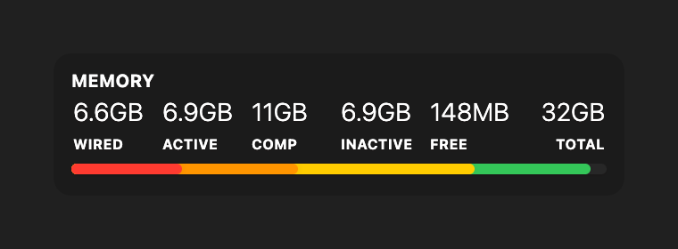

# Memory Usage

A memory usage widget for [Übersicht](http://tracesof.net/uebersicht/). It breaks system memory into wired, active, compressed, inactive, free, and total, shown as figures with a stacked bar. Colors are theme-aware, with sensible built-in defaults, so the widget works on its own. Originally based on [ubersicht-memory-bar](https://github.com/cobyism/ubersicht-memory-bar).

## Screenshot

## Installation

- Download the [repository](https://github.com/dionmunk/uebersicht-memory-usage/archive/master.zip) and extract it.
- Place the `memory-usage.widget` folder in your Übersicht extension folder.
- Refresh Übersicht.

## Theming

This widget is theme-aware. Its colors come from CSS custom properties (text, panel tint, status and series colors) with sensible built-in fallbacks, so it looks right on its own. Install the [Theme Controller](https://github.com/dionmunk/uebersicht-theme-controller) widget and this one automatically follows its color scheme and light/dark mode, staying in sync with the rest of the collection.

## License

This work is licensed under a [Creative Commons Attribution-NonCommercial 4.0 International License](https://creativecommons.org/licenses/by-nc/4.0/).
